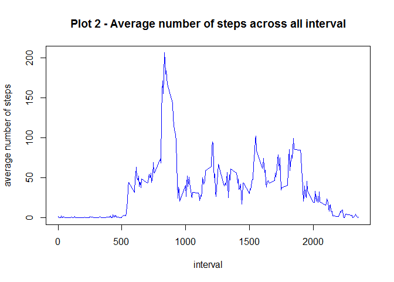
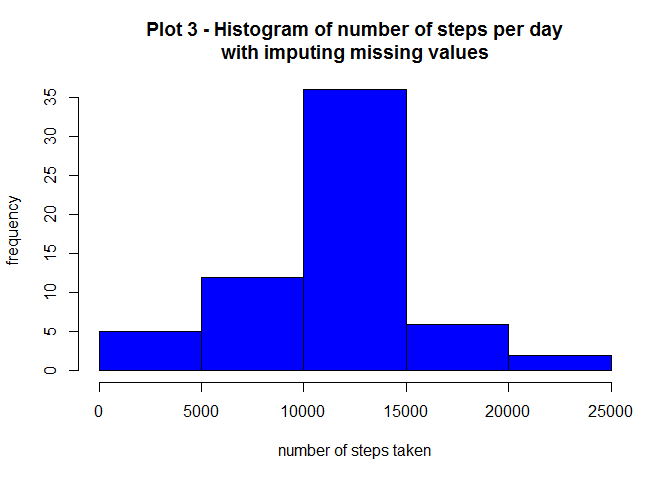
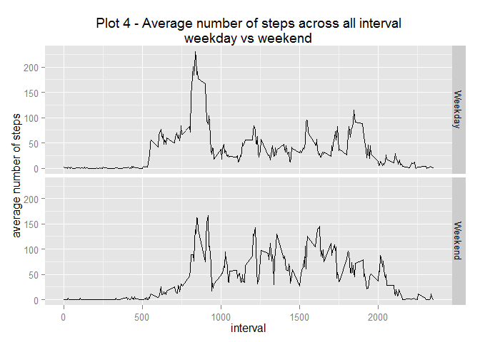

# Reproducible Research: Peer Assessment 1
Steven Fu  
Saturday, November 15, 2014  

## Loading and preprocessing the data

```r
setwd("C:\\Users\\I309666\\github\\RepData_PeerAssessment1")
unzip("activity.zip")
data<-read.csv("activity.csv")
data$date<-as.Date(data$date)
```

## What is mean total number of steps taken per day?

```r
# to check if plyr package is installed, install if necessary
is.installed <- function(x) is.element(x, installed.packages()[,1]) 
if(!is.installed("plyr")){
        install.packages("plyr")
}
library(plyr)

stepByDay <- ddply(data, .(date), summarize, steps=sum(steps))
hist(stepByDay$steps, col="blue",
     main="Plot 1 - Histogram of number of steps per day",
     xlab="number of steps taken", ylab="frequency")
```

 

```r
mean<-mean(stepByDay$steps, na.rm=TRUE)
mean
```

```
## [1] 10766.19
```

```r
median<-median(stepByDay$steps, na.rm=TRUE)
median
```

```
## [1] 10765
```

####Average number of steps taken per day is 10766.
####Median of number of steps taken per day is 10765.


## What is the average daily activity pattern?

```r
stepByInterval <- ddply(data, .(interval), summarize, steps=mean(steps,na.rm = TRUE))
plot(x = stepByInterval$interval, y = stepByInterval$steps,type="l", col="blue",
     main="Plot 2 - Average number of steps across all interval",
     xlab="interval", ylab="average number of steps")
```

 

```r
max<-stepByInterval[stepByInterval$steps==max(stepByInterval$steps),]
max
```

```
##     interval    steps
## 104      835 206.1698
```
####The interval that contains on average the maximum number of steps 
####is 206.1698113 at interval 835.


## Imputing missing values

```r
missing<-is.na(data$steps)
sum_missing<-sum(missing)
```
The number of missing observations is 2304.


```r
data2<-data
head(data2)
```

```
##   steps       date interval
## 1    NA 2012-10-01        0
## 2    NA 2012-10-01        5
## 3    NA 2012-10-01       10
## 4    NA 2012-10-01       15
## 5    NA 2012-10-01       20
## 6    NA 2012-10-01       25
```

```r
data2$intervalmean<-ave(data2$steps,data2$interval, FUN=function(x) mean(x[!is.na(x)]))
data2$steps[is.na(data2$steps)]<-data2$intervalmean[is.na(data2$steps)]
head(data2)
```

```
##       steps       date interval intervalmean
## 1 1.7169811 2012-10-01        0    1.7169811
## 2 0.3396226 2012-10-01        5    0.3396226
## 3 0.1320755 2012-10-01       10    0.1320755
## 4 0.1509434 2012-10-01       15    0.1509434
## 5 0.0754717 2012-10-01       20    0.0754717
## 6 2.0943396 2012-10-01       25    2.0943396
```


```r
stepByDay2 <- ddply(data2, .(date), summarize, steps=sum(steps,na.rm = TRUE))
hist(stepByDay2$steps, col="blue",
     main="Plot 3 - Histogram of number of steps per day\nwith imputing missing values",
     xlab="number of steps taken", ylab="frequency")
```

 

```r
mean2<-mean(stepByDay2$steps, na.rm=TRUE)
mean2
```

```
## [1] 10766.19
```

```r
median2<-median(stepByDay2$steps, na.rm=TRUE)
median2
```

```
## [1] 10766.19
```

####Average number of steps taken per day is 10766.
####Median of number of steps taken per day is 10766.
####These values are very close to the estimates from the first part of the assignment.


## Are there differences in activity patterns between weekdays and weekends?

```r
weekday <- function(date) {
        day<- weekdays(date, abbreviate =TRUE)
	if (day %in% c("Mon", "Tue","Wed","Thu","Fri"))
		return("Weekday")
	else if (day %in% c("Sat","Sun"))
		return("Weekend")
	else
		stop("Invalid Date")
}
data2$weekday<-factor(sapply(data2$date, FUN=weekday))
head(data2)
```

```
##       steps       date interval intervalmean weekday
## 1 1.7169811 2012-10-01        0    1.7169811 Weekday
## 2 0.3396226 2012-10-01        5    0.3396226 Weekday
## 3 0.1320755 2012-10-01       10    0.1320755 Weekday
## 4 0.1509434 2012-10-01       15    0.1509434 Weekday
## 5 0.0754717 2012-10-01       20    0.0754717 Weekday
## 6 2.0943396 2012-10-01       25    2.0943396 Weekday
```

```r
stepByInterval2 <- ddply(data2, .(interval,weekday), summarize, steps=mean(steps,na.rm = TRUE))
head(stepByInterval2)
```

```
##   interval weekday      steps
## 1        0 Weekday 2.25115304
## 2        0 Weekend 0.21462264
## 3        5 Weekday 0.44528302
## 4        5 Weekend 0.04245283
## 5       10 Weekday 0.17316562
## 6       10 Weekend 0.01650943
```

```r
if(!is.installed("ggplot2")){
        install.packages("ggplot2")
}
library(ggplot2)
ggplot(data=stepByInterval2, aes(interval, steps)) + geom_line() +
        facet_grid(weekday ~ . ) + xlab("interval")+ ylab("average number of steps")+
        ggtitle("Plot 4 - Average number of steps across all interval\nweekday vs weekend")
```

 

####Total number of steps taken between interval  500 and 1000 is generally higher on weekdays.
####Total number of steps taken between interval 1000 and 2000 is generally higher on weekends.
